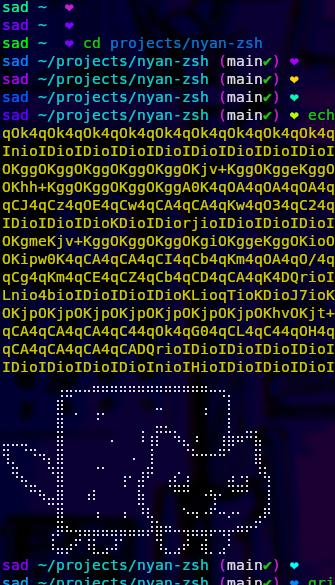

# Nyan ZSH Theme 🌈

A colorful and cheerful ZSH theme with rainbow colors and a cute nyan cat spirit!



## Features

- **Rainbow Colors**: Your prompt elements change colors between commands!
- **Git Integration**: Shows your branch and status with colorful indicators
- **Two Variants**:
  - **nyan.zsh-theme**: Simple, colorful prompt with git info
  - **nyan-mommy.zsh-theme**: Enhanced version with encouraging messages

## Installation

### Prerequisites

- [Oh My Zsh](https://ohmyz.sh/) installed
- For the nyan-mommy theme: [mommy](https://github.com/FWDekker/mommy) utility installed

### Option 1: Manual Installation

1. Clone this repository:
   ```bash
   git clone https://github.com/vxfemboy/nyan-zsh.git
   ```

2. Symlink or copy the theme files to your Oh My Zsh themes directory:
   ```bash
   ln -s $PWD/nyan-zsh/nyan.zsh-theme ${ZSH_CUSTOM:-~/.oh-my-zsh/custom}/themes/
   ln -s $PWD/nyan-zsh/nyan-mommy.zsh-theme ${ZSH_CUSTOM:-~/.oh-my-zsh/custom}/themes/
   ```

3. Set your theme in `~/.zshrc`:
   ```bash
   # For the basic theme
   ZSH_THEME="nyan"

   # OR for the mommy version
   ZSH_THEME="nyan-mommy"
   ```

4. Apply changes:
   ```bash
   source ~/.zshrc
   ```

### Option 2: Using Oh My Zsh's Custom Themes

1. Download the theme files to your custom themes directory:
   ```bash
   curl -o ${ZSH_CUSTOM:-~/.oh-my-zsh/custom}/themes/nyan.zsh-theme https://raw.githubusercontent.com/vxfemboy/zsh-nyan/main/nyan.zsh-theme
   curl -o ${ZSH_CUSTOM:-~/.oh-my-zsh/custom}/themes/nyan-mommy.zsh-theme https://raw.githubusercontent.com/vxfemboy/zsh-nyan/main/nyan-mommy.zsh-theme
   ```

2. Update your `~/.zshrc` with your chosen theme and reload.

> [!NOTE]
> For nyan-mommy.zsh you will need to add the following line to your `~/.zshrc`:
> ```bash
> # mommy config
> set -o PROMPT_SUBST
> RPS1=''  # Clear right prompt as we're using custom positioning
> ```

## Theme Variants

### nyan.zsh-theme
A simple, colorful theme with random colors that change between commands. Shows username, current directory, git branch and status.

### nyan-mommy.zsh-theme
Everything from the basic theme plus:
- Encouraging messages after commands
- Smart responses based on command success/failure
- Higher chance of messages after failed commands or when running new commands

## Configuration

You can customize the themes by editing the theme files:

- Change the color palette by modifying the `rainbow_colors` array
- Adjust git status symbols in the `ZSH_THEME_GIT_PROMPT_*` variables

## Dependencies

- **nyan.zsh-theme**: Just requires Oh My Zsh
- **nyan-mommy.zsh-theme**: Requires the [mommy](https://github.com/FWDekker/mommy) utility

## Credits

- Inspired by the nyan cat meme and colorful terminal themes
